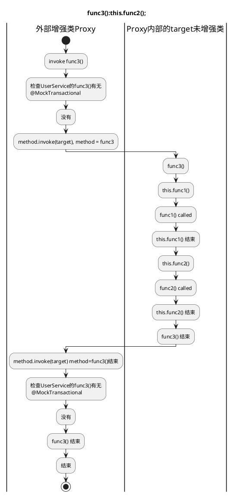
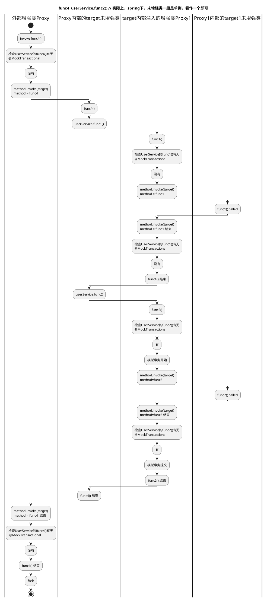
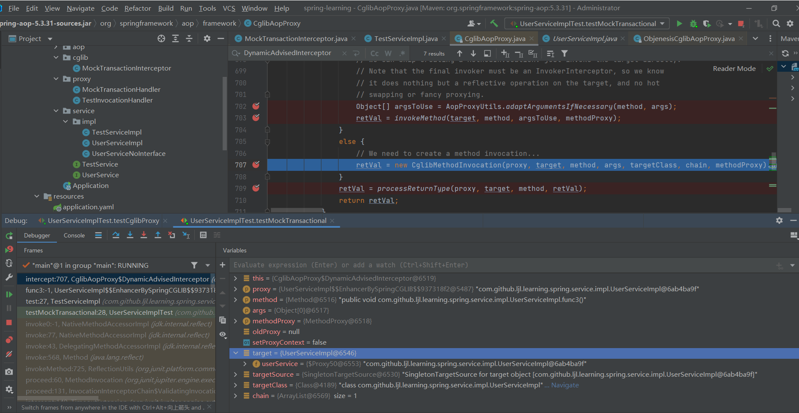
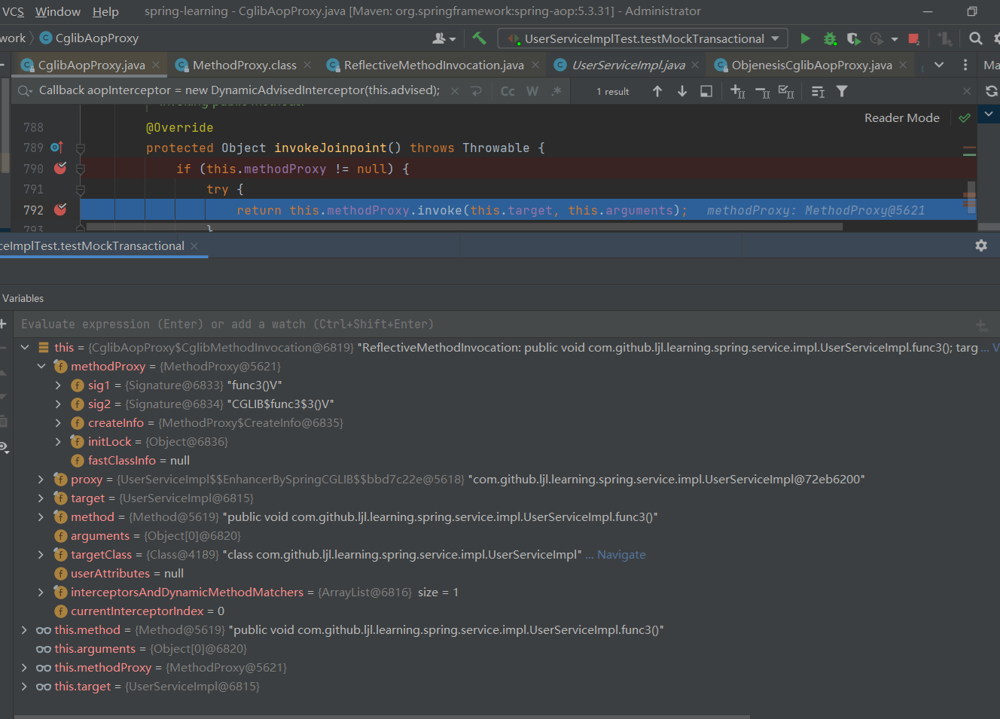
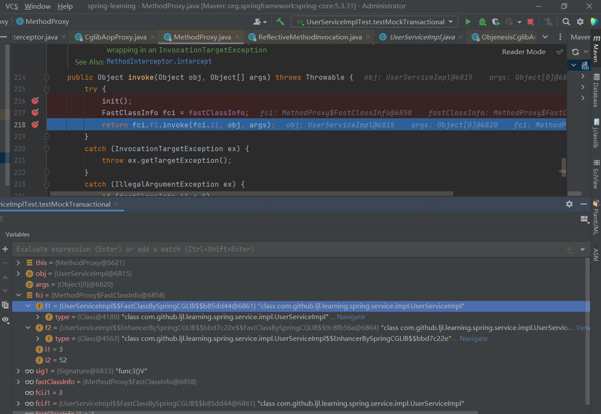

## AOP 与 动态代理

### 版本说明

SpringBoot: 2.7.18

Junit5

### 问题引入:bean内部事务方法调用

Spring相信大家都十分熟悉。开发中也常常使用@Trancsation开启事务等。

在学习过程中，遇到一种说法，事务生效需要通过代理实现。是什么意思呢

具体来说，现在需要在UserService的某方法(func2)内部，执行UserService的一个事务方法(func1)，事务是否生效呢，怎么写让事务生效呢。

观察以下代码，说明事务是否能开启
```java
@Service
public class UserServiceImpl implements UserService {

    @Transactional
    @Override
    public void func1() {
        // repo/mapper function
    }

    @Override
    public void func2() {
        this.func1();
        // other function
    }
}

@Service
public class TestService {
    @Resource
    UserService userService;

    void test() {
        userService.func2();
    }
}
```

@Transactional 注解功能比较复杂。但我们知道是基于AOP机制实现的。会生成一个代理类，来执行一系列前置和后置的方法。为便于说明，集中于理解AOP，我们不妨自行模拟实现一个AOP切面，进行测试，测试代码如下

注解与切面类
```java
package com.github.ljl.learning.spring.aop;

@Target(ElementType.METHOD)
@Retention(RetentionPolicy.RUNTIME)
public @interface MockTransactional {

}
```
```java
package com.github.ljl.learning.spring.aop;

@Aspect
@Component
public class MockTransactionalAspect {
    @Before("@annotation(mockTransactional)")
    public void beforeMethod(JoinPoint joinPoint, MockTransactional mockTransactional) {
        // 模拟事务开始
        System.out.println("Transaction started for method: " + joinPoint.getSignature().getName());
    }

    @After("@annotation(mockTransactional)")
    public void afterMethod(JoinPoint joinPoint, MockTransactional mockTransactional) {
        // 模拟事务提交
        System.out.println("Transaction committed for method: " + joinPoint.getSignature().getName());
    }
}
```
业务类
```java
public interface UserService {
    void func1();
    // 接口加在func2上面
    @MockTransactional
    void func2();
    void func3();
    void func4();
    // 测试用
    void setUserService(UserService userService);
}
```
```java
package com.github.ljl.learning.spring.service.impl;
@Service
public class UserServiceImpl implements UserService {

    @Resource
    @Lazy
    private UserService userService;

    // 实现类加在func1上面
    @MockTransactional
    @Override
    public void func1() {
        System.out.println("func1()");
    }

    @Override
    public void func2() {
        System.out.println("func2()");
    }

    @Override
    public void func3() {
        this.func1();
        System.out.println("this.func1 end\n");
        this.func2();
        System.out.println("this.func2 end\n");
    }

    @Override
    public void func4() {
        userService.func1();
        System.out.println("userService.func1 end\n");
        userService.func2();
        System.out.println("userService.func2 end\n");
    }
    // 测试用
    @Override
    public void setUserService(UserService userService) {
        this.userService = userService;
    }
}
```
测试类

```java
package com.github.ljl.learning.spring.service.impl;

@Service
public class TestServiceImpl implements TestService {

    @Resource
    private UserService userService;

    @Override
    public void test() {
        userService.func3();
        userService.func4();
    }
}
```

```java
package com.github.ljl.learning.spring.service.impl;

@SpringBootTest
class UserServiceImplTest {
    
    @Resource
    private TestService testService;

    @Test
    public void testMockTransactional() {
        testService.test();
    }
}
```
service都能够注入成功。

在阅读前，尝试回答：运行测试`testMockTransactional`，会输出什么，为什么。自行测试加以验证。


### 检查是否增强

实际上我们只要通过检查是否会生成代理类，就能说明aop的功能是否可以正常运作。

我们在test1()处打断点，观察调用栈，找到上一次的test3()或者test4()，就能观察到this或者userService是否被增强

这是test3()的情况，test3() -> this.test1();
会发现直接调用
```
"main@1" prio=5 tid=0x1 nid=NA runnable
  java.lang.Thread.State: RUNNABLE
	  at com.github.ljl.learning.spring.service.impl.UserServiceImpl.func1(UserServiceImpl.java:26)
	  at com.github.ljl.learning.spring.service.impl.UserServiceImpl.func3(UserServiceImpl.java:36)
```

这是test4()的情况，test4() -> userService.test1();
会发现注入的 userService 很明显被增强了，生成代理
``` bash
at com.github.ljl.learning.spring.service.impl.UserServiceImpl.func1(UserServiceImpl.java:26)
	  at com.github.ljl.learning.spring.service.impl.UserServiceImpl$$FastClassBySpringCGLIB$$b85dd44.invoke(<generated>:-1)
	  at org.springframework.cglib.proxy.MethodProxy.invoke(MethodProxy.java:218)
	  at org.springframework.aop.framework.CglibAopProxy$CglibMethodInvocation.invokeJoinpoint(CglibAopProxy.java:792)
// 省略约20 + 行

// 很明显生成jdk代理，调用proxy.func1()
	  at org.springframework.aop.framework.JdkDynamicAopProxy.invoke(JdkDynamicAopProxy.java:234)
	  at jdk.proxy2.$Proxy50.func1(Unknown Source:-1)

// func4
	  at com.github.ljl.learning.spring.service.impl.UserServiceImpl.func4(UserServiceImpl.java:43)
```
这说明this.test1();没有被增强，不能执行注解定义的相关操作，而userService.test1()可以，下面说明其原因

### spring-aop 实现机制

注意到，`spring-aop`是通过动态代理机制实现的，可以通过jdk或者cglib实现。

为了说明`this.func()`能否使用代理对象，我们先尝试自己手动实现这两种方式进行测试。

### jdk 代理 手动实现

熟悉Java的同学肯定见过下面的代码：一个最基本的Jdk动态代理的实现。

众所周知，Jdk代理的是接口。

阅读代码，尝试在运行前，说明控制台应当打印的内容，并说明理由
```java
public class MockTransactionHandler implements InvocationHandler {

    private final Object target;

    public MockTransactionHandler(Object target) {
        this.target = target;
    }

    @Override
    public Object invoke(Object proxy, Method method, Object[] args) {
        if (method.isAnnotationPresent(MockTransactional.class)) {
            // 模拟事务开始
            System.out.println("Mock Transaction started for method: " + method.getName());
        }
        final Object result = method.invoke(target, args);
        if (method.isAnnotationPresent(MockTransactional.class)) {
            // 模拟事务提交
            System.out.println("Mock Transaction committed for method: " + method.getName());
        }
        return result;
    }
}

class UserServiceImplTest {
    @Test
    public void testJdkProxy() {
        UserService proxy = (UserService) Proxy.newProxyInstance(
                UserServiceImpl.class.getClassLoader(),
                new Class<?>[]{UserService.class},
                new MockTransactionHandler(new UserServiceImpl())
        );
        proxy.setUserService(proxy);
        proxy.func3();
        proxy.func4();
    }
}
```
结果
```BASH
func1()
this.func1 end

func2()
this.func2 end

func1()
userService.func1 end

Mock Transaction started for method: func2
func2()
Mock Transaction committed for method: func2
userService.func2 end
```
原因分析：因为是代理接口，所以传入的是接口`new Class<?>[]{UserService.class},`

MockTransactionHandler接受一个target原始目标对象，在invoke()方法中，`final Object result = method.invoke(target, args);`

实际上就是调用原始的target的方法。invoke()在target.invoke()前后，查找接口的MockTransactional注解，如果找到了，
模拟事务的开启与提交。

因为从接口找，因此肯定找不到实现类的func1()上面的注解，也就是代理对象只执行method.invoke()(即target.func1()),无副作用，所以下面讨论func2()

this.func2()不会进入invoke()，因为this就是之前的target(未增强的原始类)

由于`proxy.setUserService(proxy);`，里面的service实际上是增强了的proxy，内部调用userService.func2()就和其他地方调用增强了的userService.func2()没有区别，所以肯定走invoke(), 因为接口有注解，被拦截，执行事务的开启与提交。

因为这里用了组合而不是继承的方式，因此spring-aop如果也使用jdk动态代理的方式，结果也是显而易见的。

用流程图说明

---
### 流程说明
#### func3流程

[func3 uml](./func3.puml)


---

#### func3() 结果
```
func1()
this.func1 end

func2()
this.func2 end
```

#### func4流程

[func4 uml](./func4.puml)



#### func4() 结果
```bash
func1()
userService.func1 end

Mock Transaction started for method: func2
func2()
Mock Transaction committed for method: func2
```

---
#### 代码说明
下面用代码说明

实际上，这段测试代码，相当于：
```
proxy.func3();
proxy.func4();
```
其中
```java
// proxy增强对象: 可以注入到其他类，
class UserServiceProxy {

    UserServiceImpl target;// 未增强类
    
    @Override
    public void func3() {
        checkStartMockTransactional(); // 增强
        target.func3(); // 调用原始类的func3();
        checkCommitMockTransactional();  // 增强
    }

    @Override
    public void func4() {
        checkStartMockTransactional(); // 增强
        target.func4(); // 调用原始类的func3();
        checkCommitMockTransactional();  // 增强
    }
}
// 本身是未增强类
class UserServiceImpl {

    private userServiceProxy userService; // 内部注入的增强类

    public void func1() {
        System.out.println("func1()");
    }

    public void func2() {
        System.out.println("func2()");
    }

    public void func3() {
        this.func1(); // 直接调用未增强类的func1(),System.out.println("func1()");
        System.out.println("this.func1 end\n");
        this.func2(); // 直接调用未增强类的func1(),System.out.println("func2()");
        System.out.println("this.func2 end\n");
    }

    public void func4() {
        userService.func1(); // 调用增强类的func1()
        System.out.println("userService.func1 end\n");
        userService.func2(); // 调用增强类的func1()
        System.out.println("userService.func2 end\n");
    }
}
// 执行UserServiceImpl.func4, 回到增强类,执行proxy.func1()
class UserServiceProxy {

    UserServiceImpl target;// 未增强类

    public void func1() {
        checkStartMockTransactional();
        target.func1();   // 调用未增强的目标类的func1(),System.out.println("func1()");
        checkCommitMockTransactional();
    }

    public void func2() {
        checkStartMockTransactional();
        target.func2();  // 调用未增强的目标类的func2(),System.out.println("func2()");
        checkCommitMockTransactional();
    }
}
```

### cglib 代理 手动实现

还有一种方式叫做cglib。同学们都听说过，cglib通过继承实现。那么，是不是类似这样的情况：

```java
class UserServiceImpl_xxx extends UserServiceImpl {
    public Object funcx() {
        check();
        super.funcx();
        check();
    }
}
// 增强类的每个funcx()都会走check()，this就是增强类，而不是原始目标类？
```
如果是，那么，你的userService如果已经是增强类，那么你调用this.funcx()，也应该可以进入invoke()之类的方法，进行校验，可以开启aop，但事实真的如此吗(肯定不是啦)

在解决这个问题前，先来一段demo，加深大家的疑惑（为什么是加深？）

demo: 自己手动通过cglib实现动态代理。

运行前，先尝试说明执行结果

注意到代理的是实现类Impl, 因此关注加了注解的func1()即可
```java
public class MockTransactionInterceptor implements MethodInterceptor {
    @Override
    public Object intercept(Object obj, Method method, Object[] args, MethodProxy methodProxy) throws Throwable {
        if (method.isAnnotationPresent(MockTransactional.class)) {
            System.out.println("Mock Transaction started for method: " + method.getName());
        }
        // invokeSuper
        Object result = methodProxy.invokeSuper(obj, args);
        if (method.isAnnotationPresent(MockTransactional.class)) {
            System.out.println("Mock Transaction committed for method: " + method.getName());
        }
        return result;
    }
}

class UserServiceImplTest {
    @Test
    public void testCglibProxy() {
        Enhancer enhancer = new Enhancer();
        enhancer.setSuperclass(UserServiceImpl.class);
        enhancer.setCallback(new MockTransactionInterceptor());

        UserService proxy = (UserService) enhancer.create();
        proxy.setUserService(proxy);
        proxy.func3();
        proxy.func4();
    }
}
```


结果
```BASH
Mock Transaction started for method: func1
func1()
Mock Transaction committed for method: func1
this.func1 end

func2()
this.func2 end

Mock Transaction started for method: func1
func1()
Mock Transaction committed for method: func1
userService.func1 end

func2()
userService.func2 end
```

我们可以发现, 即使是调用this.func1()，也被代理了，似乎和最开始讲的例子一样？

Superclass 也被增强了

然后聪明的你让spring采用cglib的方式生成代理，发现，this.func1()并没有被AOP拦截。

怎么会事呢

不知道。那就看下源码，打断点查看变量，找到最终哪里执行method.invoke()，调用目标target的方法

### cglib DynamicAdvisedInterceptor 源码

```java
class CglibAopProxy implements AopProxy, Serializable {
    private Callback[] getCallbacks(Class<?> rootClass) throws Exception {
        // Parameters used for optimization choices...
        boolean isFrozen = this.advised.isFrozen();
        boolean exposeProxy = this.advised.isExposeProxy();
        boolean isStatic = this.advised.getTargetSource().isStatic();

        // Choose an "aop" interceptor (used for AOP calls).
        Callback aopInterceptor = new DynamicAdvisedInterceptor(this.advised);
        //...代码略
    }
    /**
     * General purpose AOP callback. Used when the target is dynamic or when the
     * proxy is not frozen.
     */
    private static class DynamicAdvisedInterceptor implements MethodInterceptor, Serializable {

        private final AdvisedSupport advised;

        public DynamicAdvisedInterceptor(AdvisedSupport advised) {
            this.advised = advised;
        }

        @Override
        @Nullable
        public Object intercept(Object proxy, Method method, Object[] args, MethodProxy methodProxy) throws Throwable {
            Object oldProxy = null;  // 保存旧的代理对象
            boolean setProxyContext = false;  // 标志位，表示是否需要设置代理上下文
            Object target = null;  // 实际的目标对象
            TargetSource targetSource = this.advised.getTargetSource();  // 获取目标源

            try {
                // 如果需要暴露代理对象，设置当前代理上下文
                if (this.advised.exposeProxy) {
                    oldProxy = AopContext.setCurrentProxy(proxy);  // 保存当前的代理对象
                    setProxyContext = true;  // 标志位设为 true
                }

                // 获取目标对象
                target = targetSource.getTarget();
                Class<?> targetClass = (target != null ? target.getClass() : null);  // 获取目标对象的类
                // 获取与目标方法和目标类相关的拦截器链
                List<Object> chain = this.advised.getInterceptorsAndDynamicInterceptionAdvice(method, targetClass);
                Object retVal;  // 方法返回值

                // 如果没有拦截器且方法代理兼容
                if (chain.isEmpty() && CglibMethodInvocation.isMethodProxyCompatible(method)) {
                    // 直接调用目标对象的方法
                    Object[] argsToUse = AopProxyUtils.adaptArgumentsIfNecessary(method, args);  // 适配方法参数
                    // target就是未增强的原始对象ServiceImpl
                    retVal = invokeMethod(target, method, argsToUse, methodProxy);  // 调用目标方法
                } else {
                    // 创建 CglibMethodInvocation 对象并执行方法调用链
                    // target就是未增强的原始对象ServiceImpl
                    // 该用例执行到此分支
                    retVal = new CglibMethodInvocation(proxy, target, method, args, targetClass, chain, methodProxy).proceed();
                }

                // 处理返回值的类型
                retVal = processReturnType(proxy, target, method, retVal);
                return retVal;  // 返回结果
            } finally {
                // 释放目标对象（如果目标源不是静态的）
                if (target != null && !targetSource.isStatic()) {
                    targetSource.releaseTarget(target);
                }
                // 恢复之前的代理上下文
                if (setProxyContext) {
                    AopContext.setCurrentProxy(oldProxy);
                }
            }
        }
    }
}
```

```java
public class ReflectiveMethodInvocation implements ProxyMethodInvocation, Cloneable {
    public Object proceed() throws Throwable {
        // We start with an index of -1 and increment early.
        if (this.currentInterceptorIndex == this.interceptorsAndDynamicMethodMatchers.size() - 1) {
            // 如果当前拦截器索引已经等于拦截器链的最后一个索引，则调用目标方法（即连接点）
            // 也即此处调用目标方法
            // focus
            return invokeJoinpoint();
        }

        // 获取下一个拦截器或动态方法匹配器。
        Object interceptorOrInterceptionAdvice =
                this.interceptorsAndDynamicMethodMatchers.get(++this.currentInterceptorIndex);
        if (interceptorOrInterceptionAdvice instanceof InterceptorAndDynamicMethodMatcher) {
            // Evaluate dynamic method matcher here: static part will already have
            // been evaluated and found to match.
            InterceptorAndDynamicMethodMatcher dm =
                    (InterceptorAndDynamicMethodMatcher) interceptorOrInterceptionAdvice;
            Class<?> targetClass = (this.targetClass != null ? this.targetClass : this.method.getDeclaringClass());
            // 使用动态方法匹配器检查当前方法是否匹配。
            if (dm.methodMatcher.matches(this.method, targetClass, this.arguments)) {
                // 如果匹配，调用拦截器的 `invoke` 方法。
                return dm.interceptor.invoke(this);
            } else {
                // 如果动态匹配失败，跳过当前拦截器，递归调用 `proceed()` 执行下一个拦截器。
                return proceed();
            }
        } else {
            // 如果获取到的是普通拦截器，则直接调用拦截器的 `invoke` 方法。
            return ((MethodInterceptor) interceptorOrInterceptionAdvice).invoke(this);
        }
    }

    // 并不执行这个
    protected Object invokeJoinpoint() throws Throwable {
        return AopUtils.invokeJoinpointUsingReflection(this.target, this.method, this.arguments);
    }
}
private static class CglibMethodInvocation extends ReflectiveMethodInvocation {
    // 实际上执行的是这个方法
    @Override
    protected Object invokeJoinpoint() throws Throwable {
        if (this.methodProxy != null) {
            try {
                // 走此分支
                return this.methodProxy.invoke(this.target, this.arguments);
            }
            catch (CodeGenerationException ex) {
                logFastClassGenerationFailure(this.method);
            }
        }
        // 这里才执行前面的AopUtils.invokeJoinpointUsingReflection，本次不执行到此处
        return super.invokeJoinpoint();
    }
}
```



一通操作下来，我们终于可以确定，spring-aop中，即使是通过基于继承的cglib方式，也是拿到原始未增强类UserServiceImpl的bean，进行调用，而这和之前手动模拟的cglib有区别。

这意味着，func3()中，this表示的是未增强的对象，而不是增强后的对象，那么this.func1()调用的就是未增强的UserServiceImpl的func1()，不会再走一遍aop拦截

因此从效果上看，和jdk的组合方式相同。

### 经验总结
因此使用spring-aop时，不管采用jdk还是cglib，this.func()的方式调用service的方法，func上加的aop都不会生效。func就可以看作一个普通的方法

如果想要生效，可以使用注入自己的方式，形如
```java
@Service
public class UserServiceImpl implements UserService {

    @Resource
    @Lazy
    private UserService userService;

    @MockTransactional
    @Override
    public void func1() {
        System.out.println("func1()");
    }
    
    @Override
    public void func4() {
        userService.func1();
    }
}
```
